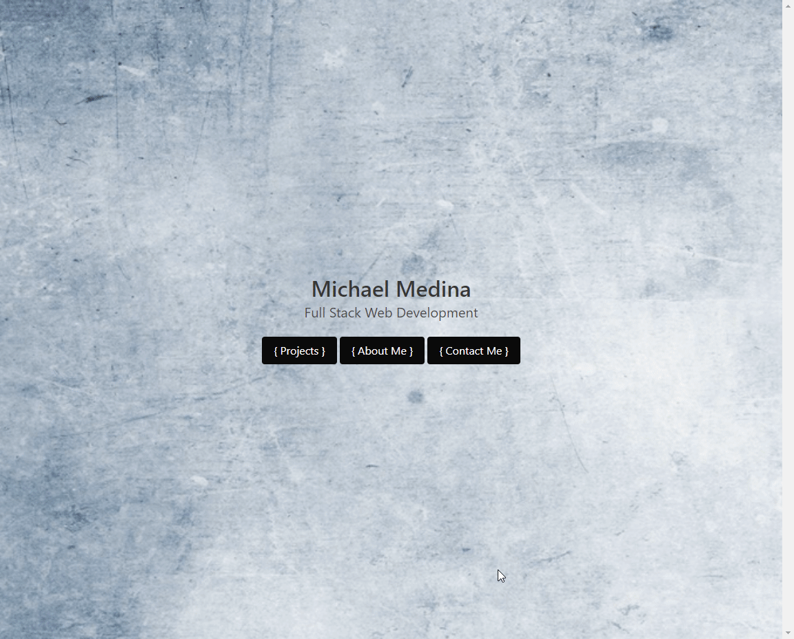

# Portfolio Launch
-----------------------
## Table of Contents
1. [Description](#description)
2. [Deployed link](#deployed-link)
3. [Code snippets](#code-snippets)
4. [Licenses](#licenses)
5. [Questions](#questions)

-----------------------
## Description
Updated portfolio 2021 with most recent projects 


-----------------------
## Deployed link
[Link](https://michaelanthonyyy.github.io/portfolio_launch/)

-----------------------
## Code snippets

```html
<div class="modal One">
    <div class="modal-card">
        <header class="modal-card-head">
            <p class="modal-card-title">Web Developer AIO Homepage</p>
            <button class="delete" aria-label="close"></button>
        </header>
        <section class="modal-card-body">
        
        <p>Drawing inspiration from seeing the Yahoo.Com homepage, a web portal was
        created with programmers in mind. Users are led to a programmer relevant homepage
        that displays tech news, allows users to leave themselves notes, check the weather, 
        watch youtube videos, access the most used reference pages, and place an emphasis on 
        mental health with sections dedicated to making the user happy despite the crazy world
        around them.
        </p>
        <br><br>
        <a href="https://github.com/michaelanthonyyy/aio-developer-homepage"
        class="button is-black is-small">Github Repository</a>
        <a href="https://michaelanthonyyy.github.io/aio-developer-homepage/"
        class="button is-black is-small">Deployed Link</a>
        </section>
    </div>
</div>
```
Utilizing one of the Bulma CSS Frameworks features of Modal Cards, the projects section was divided up into
tiles that displayed screenshots and a modal button that included Demo gif's as well as links to the respective 
project GitHub repositories and Deployed application links for reference.

-----------------------
## Licenses
This project uses a [MIT License](https://opensource.org/licenses/MIT). 

-----------------------
## Questions
Created by Michael Medina

If you have any questions you can reach me at the following: 


[michaelanthony.medinaa@gmail.com](mailto:michaelanthony.medinaa@gmail.com)  |[LinkedIn](https://www.linkedin.com/in/michaelanthonyy/) | [GitHub](https://github.com/michaelanthonyyy)  |
